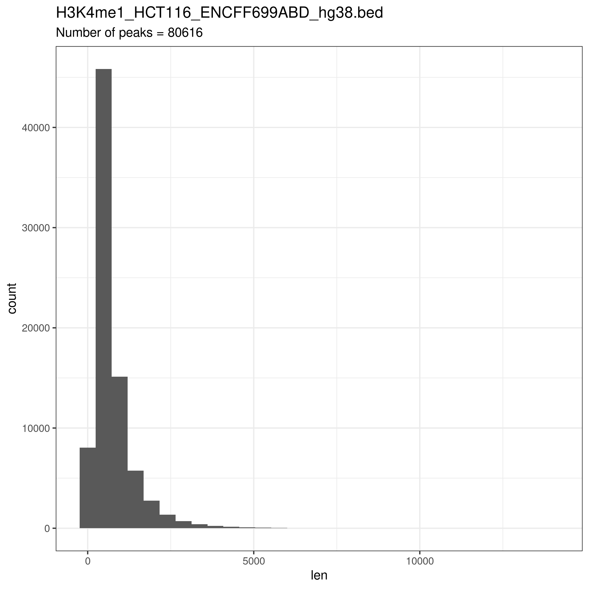
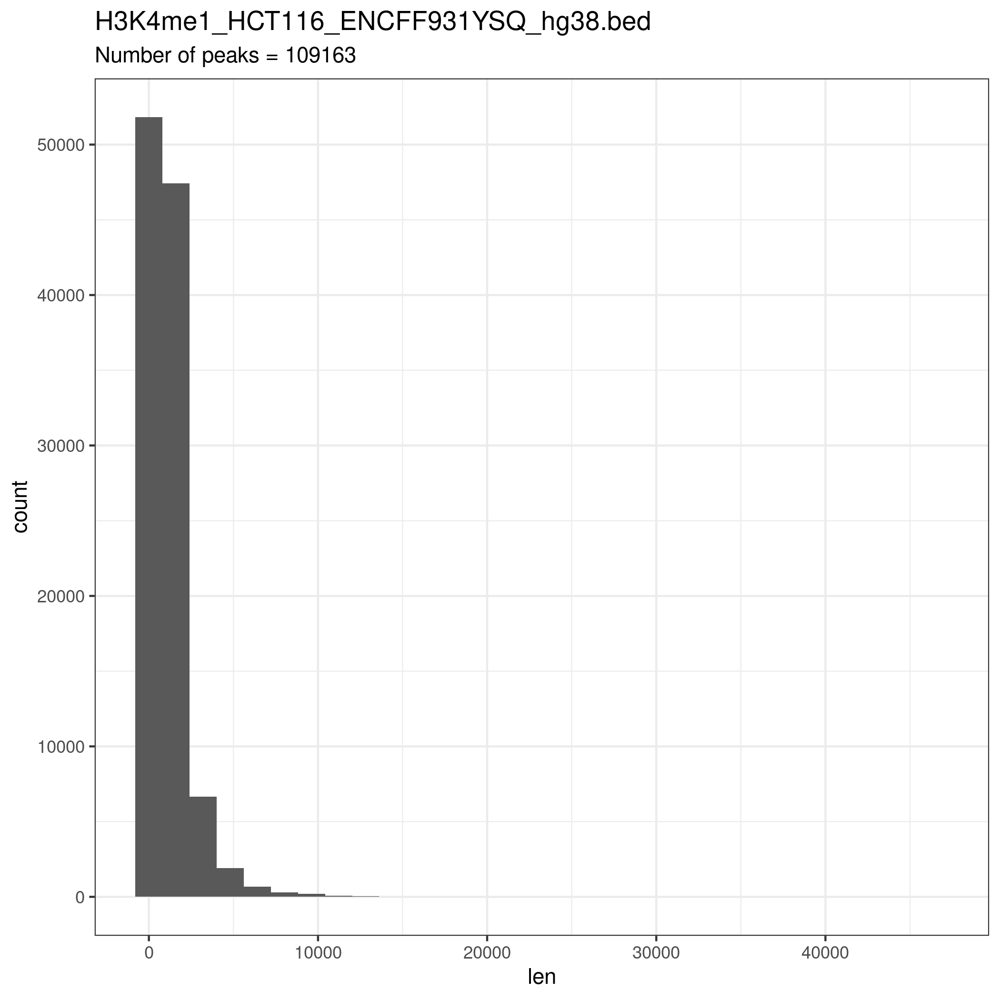
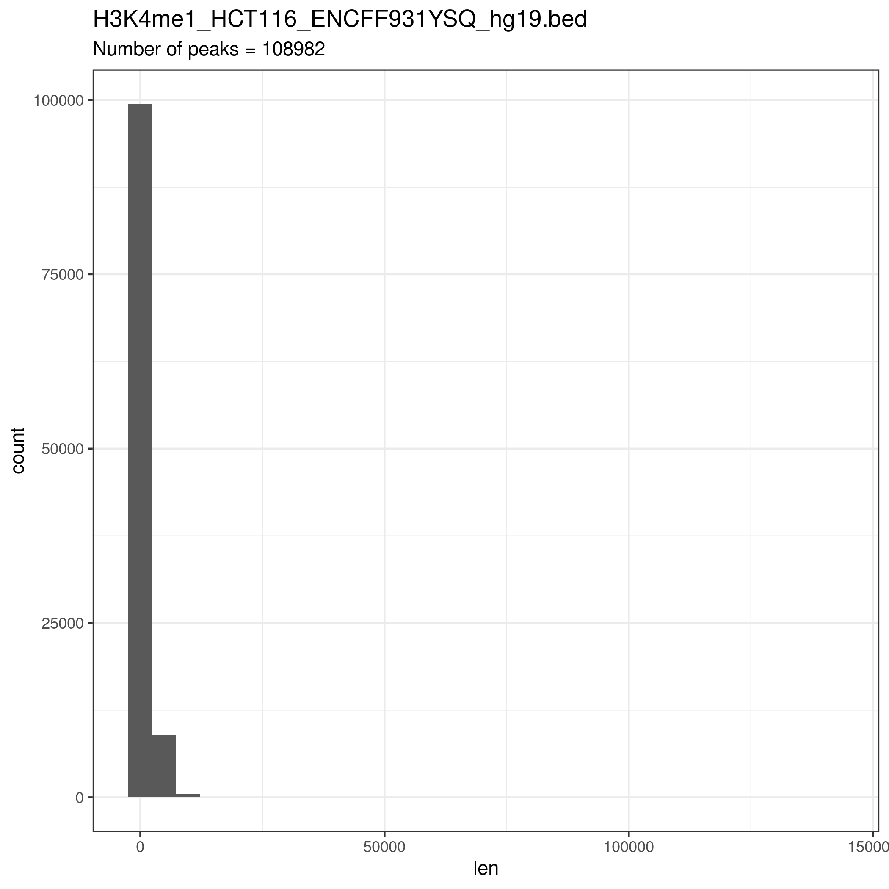
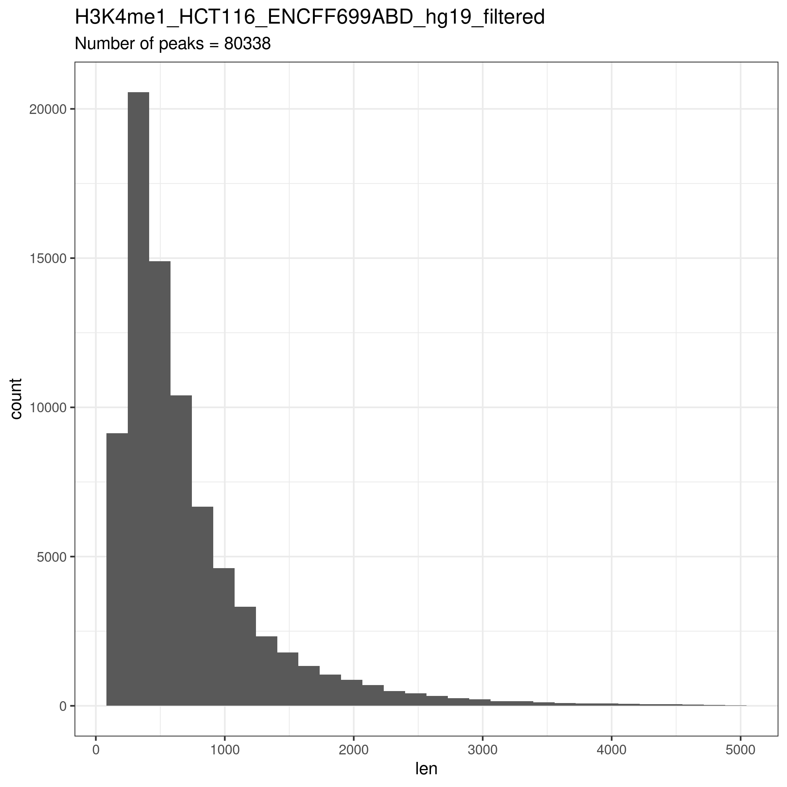
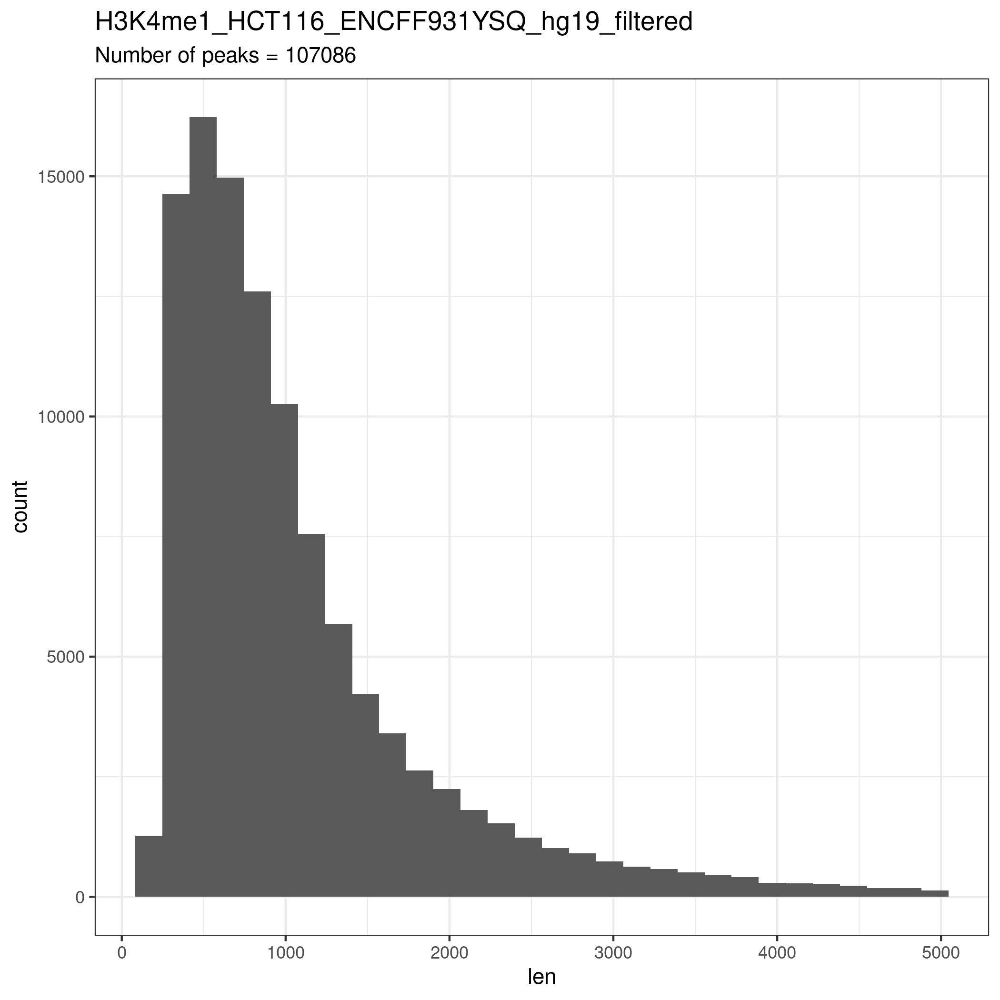
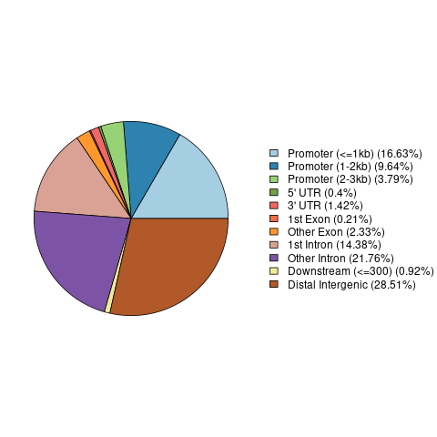
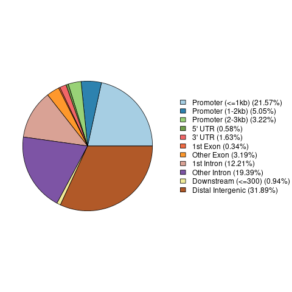
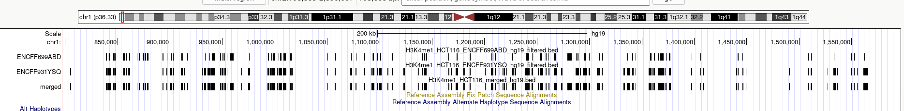
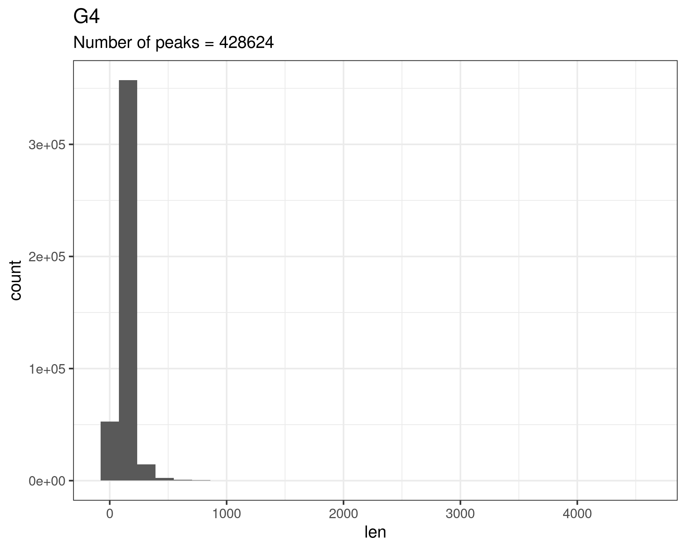
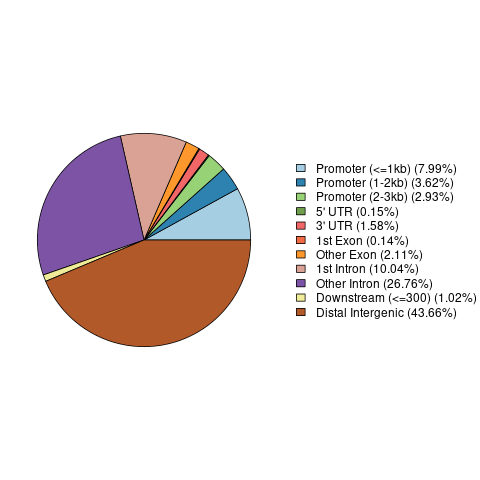

# hse21_H3K4me1_G4_human

Тип клеток: HCT116  
Гистоновая метка ENCFF699ABD https://www.encodeproject.org/files/ENCFF699ABD/  
Гистоновая метка ENCFF931YSQ https://www.encodeproject.org/files/ENCFF931YSQ/  

### Обрезаем первые 5 столбцов в исходных файлах:  
```
zcat ENCFF699ABD.bed.gz  |  cut -f1-5 > H3K4me1_HCT116_ENCFF699ABD_hg38.bed  
```

### Конвертируем из hg38 в hg19 с помощью liftOver, в файле prefix.txt описываем префиксы меток:  
```
cat ../prefix.txt | xargs -tI{} liftOver {}_hg38.bed hg38ToHg19.over.chain.gz {}_hg19.bed {}_unmapped_hg19.bed  
```

### Строим гистограммы распределения длин пик (length_hist.R)  



  

### В полученных файлах отрезаем все пики длиннее 5000 оснований (filter.sh)  
  
  
### Строим pie-чарты фильтрованных наборов с помощью ChIPseeker (chip_seeker.R)  

ENCFF699ABD:  
  
ENCFF931YSQ:  
  

### Сливаем 2 файла с метками в один
```
cat *_filtered.bed | sort -k1,1 -k2,2n > H3K4me1_HCT116_merged_hg19.bed  
```
### Проверяем объединение в геномном браузере


### Создаем единый файл с квадруплексами
```
zcat *.gz | sort -k1,1 -k2,2n | bedtools merge > G4_merged.bed
```

### Строим графики для участков (G4_description.R)  



